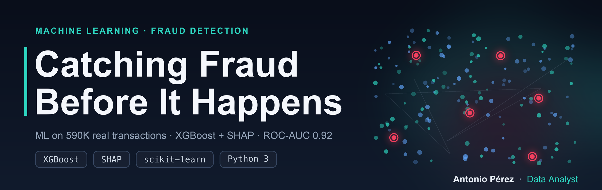
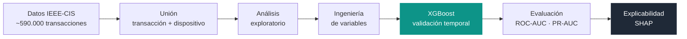
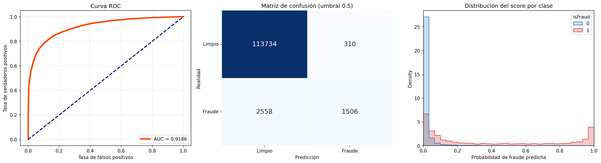
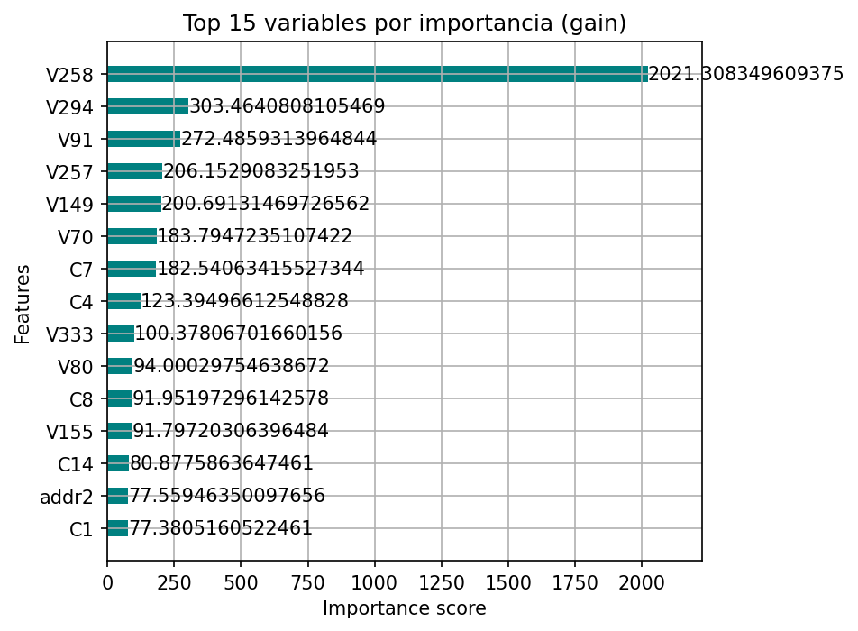
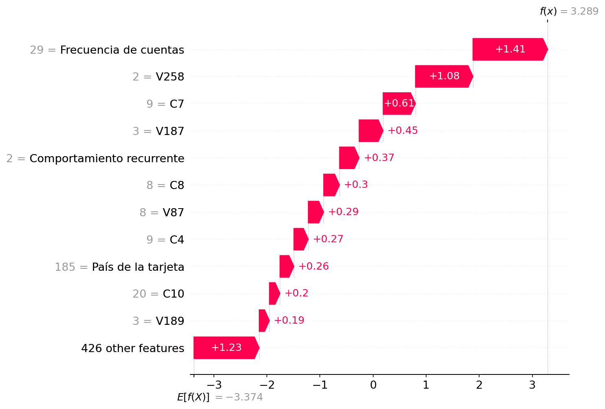
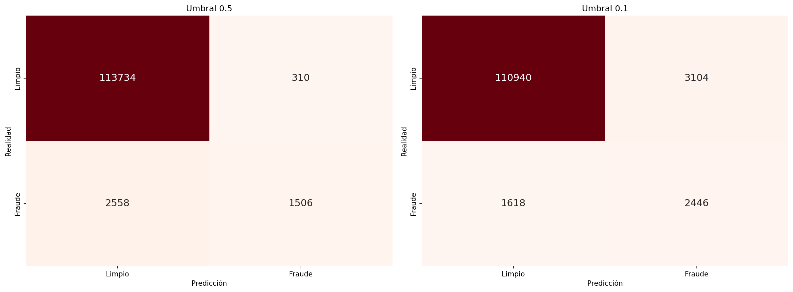

<p align="center">
  
</p>

<p align="center">
  <a href="README.md">English</a> · <b>Español</b>
</p>

<p align="center">
  
  
  
  
  
</p>

<p align="center">
  <b>Modelo de machine learning que detecta transacciones fraudulentas con tarjeta sobre ~590.000 operaciones reales.</b><br>
  Análisis exploratorio, XGBoost con validación temporal y explicabilidad con SHAP — del dato crudo a una decisión auditable.
</p>

---

## El pipeline de un vistazo



## Qué resuelve

Detectar el fraude **antes de que se complete la transacción**, equilibrando dos costes opuestos: capturar el
máximo de fraude real sin bloquear a clientes legítimos (falsos positivos). Por eso el proyecto no se queda en
una sola métrica y trata el **umbral de decisión** como una elección de negocio.

## Qué encontrarás

| Fase | Contenido |
|------|-----------|
| **Datos** | Unión de transacciones (importe, tarjeta, email, tiempo) e identidad de dispositivo vía `TransactionID`. |
| **Análisis exploratorio** | Tasa de fraude por dispositivo, dominio de email, tipo de tarjeta, hora del día, distancia IP–facturación y desviación de gasto. |
| **Modelo** | `XGBoost` con **validación temporal**: se entrena con el pasado y se valida con el futuro. |
| **Evaluación** | ROC-AUC, **PR-AUC** (adecuada al desbalance) y análisis del umbral de decisión. |
| **Explicabilidad** | `SHAP` global (qué pesa en el conjunto) y local (por qué se marca una transacción concreta). |

## Decisiones técnicas que marcan la diferencia

- **Validación temporal, no aleatoria.** Barajar las transacciones filtraría el futuro y dispararía las métricas.
- **Sin fuga de datos en la variable de gasto.** La media de gasto por tarjeta se calcula **solo con el tramo de entrenamiento**.
- **Métrica honesta con el desbalance.** Con ~3,5 % de fraude, el **PR-AUC** informa mejor que el ROC-AUC por sí solo.
- **El umbral como decisión de negocio.** Se compara 0.5 frente a 0.1 para mostrar el compromiso fraude capturado ↔ falsos positivos.

## Resultados

**ROC-AUC: 0,9186** sobre el conjunto de validación temporal (el 20 % más reciente de las transacciones).

Curva ROC, matriz de confusión y separación de los scores:


Variables más influyentes:


Explicabilidad local — por qué se marca una transacción como fraude (SHAP):


Umbral de decisión — capturar más fraude a costa de más falsos positivos:


## Cómo ejecutar

El dataset es grande; se recomienda ejecutarlo en [Google Colab](https://colab.research.google.com/github/alpc-data-analyst/fraud-detection-ieee-cis/blob/main/deteccion_fraude.ipynb) (RAM gratuita, sin instalar nada en local).

```bash
pip install opendatasets pandas numpy matplotlib seaborn scikit-learn xgboost shap
```

Abre `deteccion_fraude.ipynb` y ejecuta las celdas de arriba a abajo. La primera descarga el dataset
desde Kaggle y pedirá tus credenciales (usuario y API key de Kaggle).

## Stack

`pandas` · `numpy` · `scikit-learn` · `XGBoost` · `SHAP` · `matplotlib` · `seaborn`

## Posibles mejoras

- Validación cruzada temporal (varios cortes) en lugar de un único *split*.
- Calibración de probabilidades y `scale_pos_weight` para el desbalance de clases.
- Variables agregadas de frecuencia y *velocity* por tarjeta, dispositivo e IP.
- Ajuste del umbral según el coste real de cada tipo de error.
