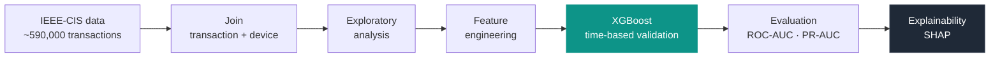

<p align="center">
  
</p>

<p align="center">
  <b>English</b> · <a href="README.es.md">Español</a>
</p>

<p align="center">
  
  
  
  
  
</p>

<p align="center">
  <b>Machine learning model that flags fraudulent card transactions across ~590,000 real operations.</b><br>
  Exploratory analysis, XGBoost with time-based validation and SHAP explainability — from raw data to an auditable decision.
</p>

---

## The pipeline at a glance



## What it solves

Detect fraud **before the transaction clears**, balancing two opposing costs: catching as much real fraud as
possible without blocking legitimate customers (false positives). That's why the project goes beyond a single
metric and treats the **decision threshold** as a business choice.

## What's inside

| Stage | Content |
|-------|---------|
| **Data** | Join of transactions (amount, card, email, time) with device identity via `TransactionID`. |
| **Exploratory analysis** | Fraud rate by device, email domain, card type, hour of day, IP–billing distance and spending deviation. |
| **Model** | `XGBoost` with **time-based validation**: trained on the past, validated on the future. |
| **Evaluation** | ROC-AUC, **PR-AUC** (suited to class imbalance) and decision-threshold analysis. |
| **Explainability** | `SHAP`, both global (what drives the model overall) and local (why a single transaction is flagged). |

## Key technical decisions

- **Time-based validation, not random.** Shuffling transactions would leak the future and inflate the metrics.
- **No data leakage in the spending feature.** The per-card mean spend is computed **on the training window only**.
- **An honest metric for imbalance.** With ~3.5% fraud, **PR-AUC** is more informative than ROC-AUC alone.
- **The threshold as a business decision.** 0.5 vs 0.1 is compared to expose the trade-off caught fraud ↔ false positives.

## Results

**ROC-AUC: 0.9186** on the time-based validation set (the most recent 20% of transactions).

ROC curve, confusion matrix and score separation:


Most influential features:


Local explainability — why one transaction is flagged as fraud (SHAP):


Decision threshold — catching more fraud at the cost of more false positives:


## How to run

The dataset is large; running on [Google Colab](https://colab.research.google.com/github/alpc-data-analyst/fraud-detection-ieee-cis/blob/main/deteccion_fraude.ipynb) is recommended (free RAM, no local setup).

```bash
pip install opendatasets pandas numpy matplotlib seaborn scikit-learn xgboost shap
```

Open `deteccion_fraude.ipynb` and run the cells top to bottom. The first cell downloads the dataset
from Kaggle and asks for your Kaggle credentials (username and API key).

## Tech stack

`pandas` · `numpy` · `scikit-learn` · `XGBoost` · `SHAP` · `matplotlib` · `seaborn`

## Possible improvements

- Time-based cross-validation (several folds) instead of a single split.
- Probability calibration and `scale_pos_weight` for the class imbalance.
- Aggregated frequency / velocity features per card, device and IP.
- Threshold tuning driven by the real cost of each error type.
